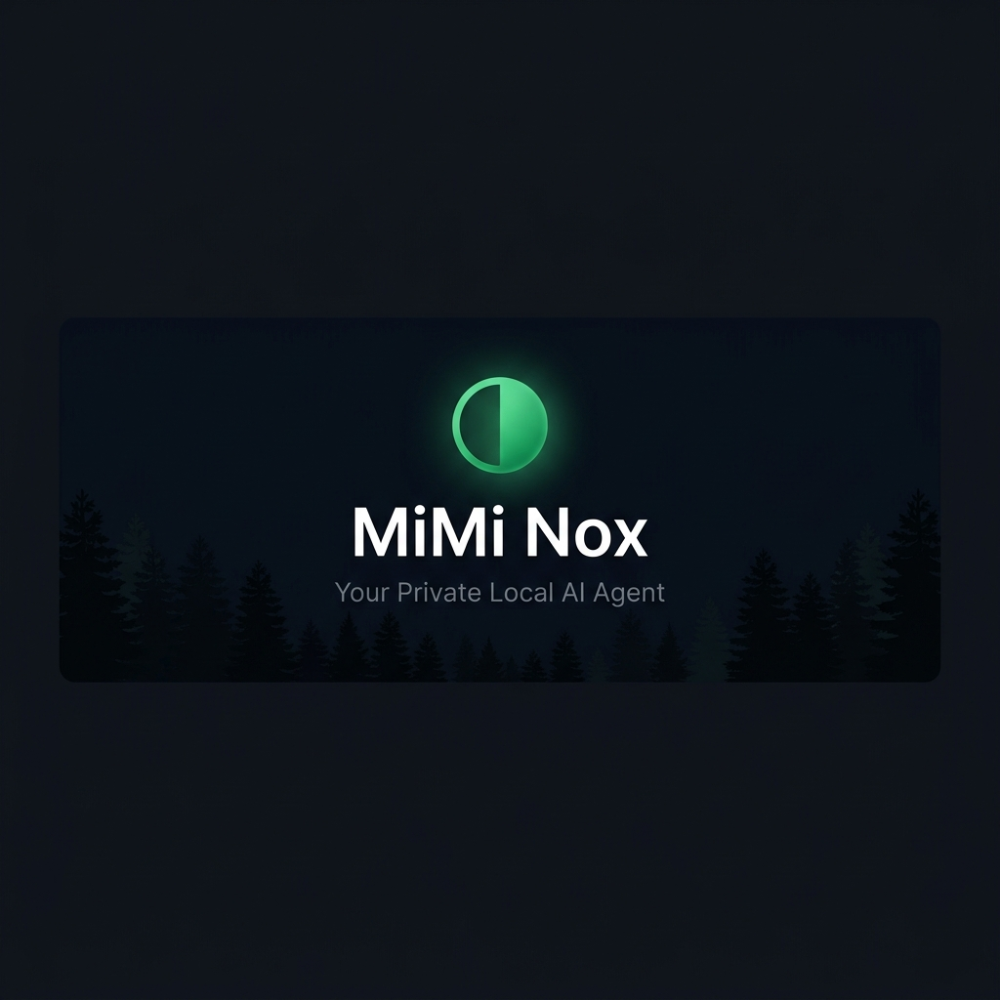
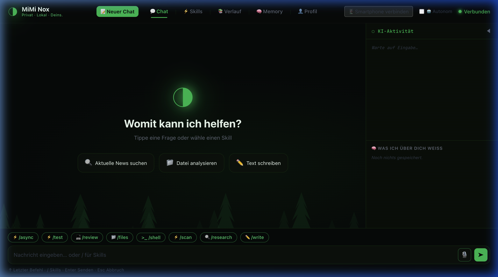
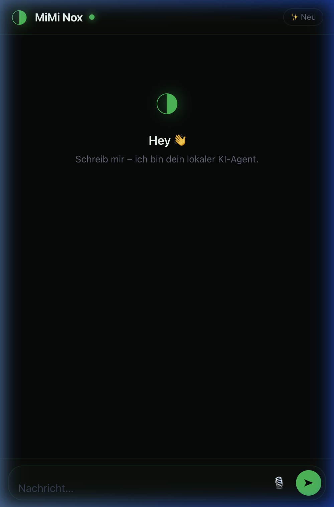

<div align="center">



<br>

**Dein privater, lokaler KI-Agent. Ohne Cloud. Ohne Tracking. Aus dem Schwarzwald.**

[](https://python.org)
[](https://ollama.com)
[](https://ai.google.dev/gemma)
[](LICENSE)
[](#-testing)

[Schnellstart](#-schnellstart) · [Features](#-features-auf-einen-blick) · [Screenshots](#-screenshots) · [API Docs](#-api-referenz) · [Contributing](#-contributing)

</div>

---

## 🎯 Was ist MiMi Nox?

MiMi Nox ist ein **vollständig lokaler, autonomer AI-Agent** – kein Abonnement, keine API-Keys, kein Cloud-Zwang. Er läuft als Web-App mit Premium-Browser-Interface und nutzt **Gemma 4 (E4B)** über [Ollama](https://ollama.com) direkt auf deiner Maschine.

> *"Dein Rechner schläft nie. MiMi auch nicht."*

### Warum MiMi Nox?

- 🔒 **100% privat** – Keine Daten verlassen deinen Rechner. Kein Telemetry.
- 🧠 **Autonom** – ReAct-Loop mit Reflexion, selbstkorrigierende Antworten
- 🛠 **15 Tools** – Web-Suche, Shell, Dateisystem, Vision, Browser-Automatisierung
- 📱 **Mobile First** – PWA-fähig, QR-Code-Pairing, WhatsApp-Style Chat
- ⚡ **Offline-fähig** – Funktioniert ohne Internet (außer Web-Suche & TTS)

---

## 📸 Screenshots

<div align="center">

### Desktop Interface



*Schwarzwald-Edition Design mit KI-Aktivitäts-Panel, Skills und Langzeitgedächtnis*

<br>

### Mobile Chat (via QR-Code)



*WhatsApp-Style Chat – scan den QR-Code im Desktop und chatte sofort los*

</div>

---

## ⚡ Schnellstart

**Voraussetzungen:** Python 3.10+, [Ollama](https://ollama.com) installiert

### Ein-Befehl-Setup

```bash
git clone https://github.com/MimiTechAi/mimi-nox.git
cd mimi-nox
./install.sh
```

Das Skript erledigt alles:
1. ✅ Python-Version prüfen (≥ 3.10)
2. ✅ Ollama installieren (falls fehlt)
3. ✅ `gemma4:e4b` herunterladen (~2.5 GB, einmalig)
4. ✅ Virtuelle Umgebung + Abhängigkeiten
5. ✅ Optionaler Sofortstart

### Manuelles Setup

```bash
git clone https://github.com/MimiTechAi/mimi-nox.git
cd mimi-nox
python -m venv .venv && source .venv/bin/activate
pip install -e ".[dev,voice]"
```

### Starten

```bash
# Web-App (empfohlen)
python run_server.py

# Mit Optionen
python run_server.py --port 9000     # Anderer Port
python run_server.py --reload         # Dev-Modus mit Auto-Reload

# TUI (Terminal-Alternative)
mimi-nox
mimi-nox --model llama3.3           # Anderes Modell
```

Dann im Browser: **http://127.0.0.1:8765** 🚀

---

## ✨ Features auf einen Blick

### 🤖 KI-Kern

| Feature | Details |
|---|---|
| **ReAct + Reflexion** | Selbstkorrigierende Antworten mit eingebautem Qualitäts-Check |
| **Tool Calling** | 15 verifizierte Tools – Web, Shell, Dateien, Vision, Browser |
| **Swarm Pipeline** | Multi-Agent-Parallel-Ausführung via `/swarm` |
| **Streaming** | Token-by-Token-Ausgabe mit SSE |
| **Thinking Mode** | Echtzeit-Reasoning-Visualisierung (Gemma 4 native) |

### 🗂 Gedächtnis & Kontext

| Feature | Details |
|---|---|
| **Vektorspeicher** | Semantisches Langzeitgedächtnis (ChromaDB) |
| **Session-Persistence** | Nahtlose Fortsetzung via atomic-write JSON |
| **User-Profil** | Lernende Persona – Name, Expertise, Sprache, Stil |
| **Fehler-Journal** | Sammelt Korrekturen, verhindert Wiederholung |
| **Feedback-Loop** | 👍/👎 pro Antwort → verbessert zukünftige Qualität |

### 🛠 Tools (15 – alle verifiziert ✅)

<details>
<summary><strong>Alle 15 Tools anzeigen</strong></summary>

| Tool | Funktion | Plattform |
|---|---|---|
| `web_search` | DuckDuckGo-Suche + Context-Extraktion | Alle |
| `browser_go` | Headless Playwright – echter Browser | Alle |
| `browser_screenshot` | Browser-Screenshot für KI-Analyse | Alle |
| `browser_click` | Vision-basierter Klick im Browser | Alle |
| `browser_type` / `browser_press` | Text tippen / Taste drücken im Browser | Alle |
| `run_shell` | Shell-Befehle (**immer** mit User-Bestätigung) | Alle |
| `file_search` | Spotlight (macOS) / find (Linux) | Alle |
| `read_file` | Datei lesen (Whitelist-geschützt) | Alle |
| `list_directory` | Ordnerinhalt auflisten | Alle |
| `load_workspace` | Ganzes Verzeichnis laden (128K Context) | Alle |
| `analyze_image` | Bild per Gemma4 Vision analysieren (OCR) | Alle |
| `take_screenshot` | Desktop-Screenshot | macOS |
| `vision_click` | KI-gesteuerte Maus-Klicks auf dem Desktop | macOS |
| `vision_type` | Text tippen über GUI-Steuerung | macOS |
| `get_datetime` | Aktuelle Uhrzeit und Datum auf Deutsch | Alle |

</details>

### 🌐 Browser Interface

| Feature | Details |
|---|---|
| **Live Streaming** | SSE-basiert, Token erscheinen sofort |
| **Artifacts Panel** | Code/HTML in Seitenleiste mit Syntax-Highlighting |
| **Markdown Rendering** | marked.js + DOMPurify, inkl. Code-Highlighting |
| **Memory Tab** | Vektorspeicher im Browser durchsuchen |
| **Skills Tab** | Eigene Skills erstellen, bearbeiten, löschen |
| **Voice** | Whisper-Transkription + Text-to-Speech |
| **PWA** | Installierbar als App, funktioniert offline |
| **Mobile Chat** | Eigene `mobile.html` – WhatsApp-Style via QR-Code |
| **Hintergrund-Jobs** | APScheduler – zeitgesteuerte Tasks |

---

## 📱 Mobile & QR-Pairing

1. Öffne MiMi Nox im Desktop-Browser
2. Klicke auf **"📱 Smartphone verbinden"**
3. Scanne den QR-Code mit deinem Handy
4. → Sofort chatten über eigene Mobile-UI

Funktioniert auch über das Internet (automatischer SSH-Tunnel) und als installierbare PWA auf iOS & Android.

---

## ⚡ Skills & Slash-Commands

### Eingebaute Skills (8)

| Skill | Trigger | Funktion |
|---|---|---|
| Web-Researcher | `/research` | Internet-Recherche mit Quellen |
| File-Assistant | `/files` | Dateien finden & analysieren |
| Writer | `/write` | E-Mails, Texte, Blog-Artikel |
| Code-Reviewer | `/review` | Code-Analyse als Senior Engineer |
| Shell-Helper | `/shell` | Terminal-Befehle vorschlagen |
| Vision-Assistant | `/scan` | Bilder/Screenshots analysieren |

### Slash-Commands

| Befehl | Funktion |
|---|---|
| `/learn <Thema>` | MiMi lernt dein Workflow-Wissen als neuen Skill |
| `/post <Thema>` | LinkedIn-Post schreiben |
| `/debug <Code>` | Code debuggen |
| `/idea <Thema>` | 5 Startup-Ideen generieren |
| `/explain <Konzept>` | Einfach erklären |
| `/commit <Änderungen>` | Conventional Commit Message |
| `/swarm <Aufgabe>` | Multi-Agent-Pipeline starten |

### Eigenen Skill erstellen

**Via Chat:** `/learn Wie wir unsere FastAPI-Routen strukturieren`

**Via UI:** Skills Tab → "Neuer Skill" → Ausfüllen → Speichern

**Manuell:** Markdown-Datei in `skills/` anlegen:

```markdown
---
name: mein-skill
trigger: /mein-trigger
description: Was dieser Skill macht
tools:
  - web_search
  - read_file
---

## Dein System-Prompt hier

Anleitung was MiMi in diesem Modus tun soll...
```

---

## 🎨 Artifacts Panel

Inspiriert von Claude's Artifact-System: Code-Blöcke öffnen sich in einem schlanken Seitenpanel.

```
┌──────────────────────────┐  ┌───────────────────────────────┐
│ Chat                     │  │ 📄 script.py   [Python]       │
│                          │  │─────────────────────────────  │
│ Hier ist dein Skript:    │  │ import os                     │
│                          │  │ from pathlib import Path      │
│ [📄 script.py → Öffnen]  │  │                               │
│                          │  │ def find_files(path):         │
└──────────────────────────┘  └───────────────────────────────┘
```

- ✅ Syntax-Highlighting (14 Sprachen)
- ✅ HTML-Preview in sandboxed iframe
- ✅ Copy & Download
- ✅ Drag-to-Resize (320–800px)
- ✅ `Esc` schließt das Panel

---

## ⏰ Hintergrund-Jobs (Scheduler)

```bash
# Via Chat
/schedule "täglich 08:00" "Erstelle einen Tages-Briefing zu Tesla-News"

# Via API
POST /api/schedule
{
  "cron": "0 8 * * *",
  "task": "Erstelle einen Tages-Briefing zu Tesla-News"
}
```

---

## 🖥 Visual Computer Use

MiMi kann deinen Desktop wie ein Mensch bedienen (nur macOS):

```
1. Screenshot des Bildschirms machen
2. Vision-Modell analysiert: "Wo ist der 'Speichern'-Button?"
3. X/Y-Koordinaten berechnen → Maus-Klick ausführen
```

> ⚠️ **macOS:** Systemeinstellungen → Datenschutz → **Bedienungshilfen** und **Bildschirmaufnahme** für Terminal aktivieren.

---

## ⌨️ Keyboard Shortcuts

| Taste | Aktion |
|---|---|
| `Enter` | Nachricht senden |
| `Shift+Enter` | Neue Zeile |
| `↑` / `↓` | Eingabe-Verlauf navigieren |
| `Esc` | Eingabe leeren · Panel schließen |
| `Tab` | Artifact Panel resizen |

---

## 📡 API-Referenz

Der Server läuft auf `http://127.0.0.1:8765`. Swagger-Docs: `/api/docs`

<details>
<summary><strong>Alle API-Endpunkte anzeigen</strong></summary>

### Chat

| Methode | Endpunkt | Beschreibung |
|---|---|---|
| `POST` | `/api/chat` | Synchroner Chat |
| `POST` | `/api/chat/stream` | SSE-Stream (empfohlen) |
| `POST` | `/api/chat/approve` | Tool-Bestätigung |

### Memory

| Methode | Endpunkt | Beschreibung |
|---|---|---|
| `GET` | `/api/memory/list` | Alle Einträge |
| `GET` | `/api/memory/search?q=...` | Semantische Suche |
| `DELETE` | `/api/memory/{id}` | Eintrag löschen |

### Skills

| Methode | Endpunkt | Beschreibung |
|---|---|---|
| `GET` | `/api/skills` | Alle Skills |
| `POST` | `/api/skills` | Skill erstellen |
| `PUT` | `/api/skills/{name}` | Skill aktualisieren |
| `DELETE` | `/api/skills/{name}` | Skill löschen |

### Profil, Audio, Mobile, Scheduler

| Methode | Endpunkt | Beschreibung |
|---|---|---|
| `GET` | `/api/health` | Server-Status + Ollama-Verbindung |
| `GET` | `/api/profile` | User-Profil laden |
| `PUT` | `/api/profile` | User-Profil aktualisieren |
| `POST` | `/api/audio/transcribe` | Whisper-Transkription |
| `POST` | `/api/audio/tts` | Text-to-Speech |
| `GET` | `/api/mobile/qr` | QR-Code für Mobile-Pairing |
| `POST` | `/api/mobile/ping` | Mobile-Verbindung registrieren |
| `GET` | `/api/schedule` | Alle Hintergrund-Jobs |
| `POST` | `/api/schedule` | Job hinzufügen |
| `DELETE` | `/api/schedule/{job_id}` | Job löschen |
| `POST` | `/api/feedback/thumbs_up` | Positives Feedback |
| `POST` | `/api/feedback/thumbs_down` | Negatives Feedback |

### SSE-Event-Typen

| Type | Bedeutung |
|---|---|
| `thinking_start` / `thinking` | Reasoning-Token |
| `chunk` | Antwort-Token |
| `activity` | Tool-Aufruf |
| `artifact` | Code-Artifact → Panel öffnen |
| `reflect` | Qualitätsprüfung |
| `revision` | Überarbeitung eingeleitet |
| `done` | Stream beendet |

</details>

---

## 🏗 Architektur

```
mimi-nox/
│
├── run_server.py              Web-App-Einstiegspunkt
├── clawdash.py                TUI-Einstiegspunkt + CLI
├── install.sh                 One-Command-Setup-Skript
├── pyproject.toml             Package-Konfiguration
│
├── core/                      Reines Async-Python – kein UI
│   ├── chat.py                Ollama AsyncClient + Streaming
│   ├── react.py               ReAct-Loop + Reflexion
│   ├── tools.py               Tool-Engine (15 Tools)
│   ├── artifact_detector.py   Code-Block-Erkennung für Artifacts
│   ├── browser.py             Playwright Headless Browser
│   ├── vision.py              PyAutoGUI + Screenshot-Analyse
│   ├── vision_memory.py       Koordinaten-Lerngedächtnis
│   ├── scheduler.py           APScheduler Hintergrund-Jobs
│   ├── skill_builder.py       Auto-Skill-Generierung via /learn
│   ├── skills.py              Skill-Loader + CRUD
│   ├── commands.py            Slash-Command-Registry
│   ├── swarm.py               Multi-Agent-Parallel-Pipeline
│   ├── memory.py              ChromaDB Vektorspeicher
│   ├── session.py             JSON-Persistence (atomic write)
│   ├── profile.py             User-Profil (JSON)
│   ├── corrections.py         Fehler-Journal
│   ├── feedback.py            👍/👎 Feedback-Store
│   ├── transcribe.py          Faster-Whisper STT
│   └── types.py               Message TypedDict
│
├── server/                    FastAPI Backend
│   ├── main.py                App-Factory + CORS + Static Files
│   └── routes/                REST-API Endpunkte
│
├── app/src/                   Web-Frontend (kein Framework)
│   ├── index.html             Desktop App-Shell + PWA-Meta
│   ├── mobile.html            📱 WhatsApp-Style Chat
│   ├── main.js                NoxApp Controller
│   ├── artifact.js            ArtifactStore + ArtifactPanel
│   ├── style.css              Schwarzwald-Edition Design
│   ├── manifest.json          PWA-Manifest
│   └── service-worker.js      Cache-First Service Worker
│
├── skills/                    8 eingebaute Skills
├── ui/                        TUI (Textual) – Alternative
├── docs/screenshots/          README-Screenshots
└── tests/                     248 Tests + 32 GWT-Validierungen
```

---

## 🧪 Testing

**248 Unit-Tests + 32 Live-Validierungen.** Strategie: TDD mit BDD-Notation (Given-When-Then).

```bash
# Unit-Tests (schnell, alle gemockt)
pytest tests/ -v
# → 248 passed ✅

# Live-Validierung (gegen laufenden Server + Ollama)
python tests/validate_all_capabilities.py
# → 32/32 bestanden ✅ (Core, Tools, API einzeln geprüft)
```

<details>
<summary><strong>Test-Module im Detail</strong></summary>

| Modul | Testet |
|---|---|
| `test_artifact_detector.py` | Artifact-Erkennung (11 BDD-Tests) |
| `test_api.py` | Alle REST-Endpunkte |
| `test_chat.py` | Ollama-Streaming + Fehlerbehandlung |
| `test_tools.py` | Tool-Engine, alle 15 Tools |
| `test_react.py` | ReAct-Loop + Reflexionslogik |
| `test_skills.py` | Skill-Loader, CRUD, Trigger |
| `test_skill_builder.py` | Auto-Skill-Generierung |
| `test_memory.py` | ChromaDB-Vektorspeicher |
| `test_vision.py` | Screenshot + Koordinaten-Erkennung |
| `test_swarm.py` | Multi-Agent-Parallel-Pipeline |
| `test_audio.py` | Whisper-Transkription + TTS |
| `test_mobile.py` | QR-Code + Mobile-Pairing |
| `validate_all_capabilities.py` | **32 GWT-Live-Tests** |
| ... | + 12 weitere |

</details>

---

## 💻 Systemanforderungen

| | Minimum | Empfohlen |
|---|---|---|
| **OS** | macOS 13+ / Ubuntu 22+ | macOS 14+ (Apple Silicon) |
| **Python** | 3.10 | 3.12+ |
| **RAM** | 8 GB | 16 GB+ |
| **Storage** | 5 GB | 20 GB+ |
| **GPU** | – | M1/M2/M3 oder NVIDIA |

### Plattform-Kompatibilität

| Feature | macOS | Linux | Windows |
|---|---|---|---|
| Chat, Skills, Memory, alle Tools | ✅ | ✅ | ✅ |
| Headless Browser | ✅ | ✅ | ✅ |
| Vision Click/Type (Desktop-GUI) | ✅ | ⚠️ eingeschränkt | ❌ |
| Desktop-Screenshot | ✅ | ⚠️ | ❌ |
| PWA + QR-Pairing | ✅ | ✅ | ✅ |
| TTS (Edge-TTS) | ✅ | ✅ | ✅ |

> **Hinweis:** MiMi Nox wurde primär für **macOS** entwickelt. Desktop-Automatisierung erfordert: *Systemeinstellungen → Datenschutz → Bedienungshilfen + Bildschirmaufnahme*.

---

## 🔒 Sicherheit & Datenschutz

| Mechanismus | Beschreibung |
|---|---|
| **Local-First** | Keine Daten verlassen deinen Rechner |
| **Shell-Sandbox** | Befehle benötigen **immer** User-Bestätigung |
| **Datei-Whitelist** | Zugriff nur auf Desktop, Documents, Downloads, Projects, tmp |
| **iframe-Sandbox** | HTML-Artifacts ohne Netzwerkzugriff |
| **DOMPurify** | Alle Markdown-Ausgaben XSS-bereinigt |
| **Vision-Sandbox** | GUI-Aktionen nur nach expliziter Freigabe |
| **Kein Telemetry** | Null Tracking, null Analytics, null Logs nach extern |

---

## 🛠 Entwicklung

```bash
# Dev-Setup
pip install -e ".[dev,voice]"

# Tests
pytest tests/ -v

# Web-App mit Auto-Reload
python run_server.py --reload

# Playwright-Browser (einmalig)
playwright install chromium
```

---

## 🤝 Contributing

Beiträge sind willkommen! Bitte beachte:

1. Fork das Repository
2. Erstelle einen Feature-Branch (`git checkout -b feat/mein-feature`)
3. Schreibe Tests (Given-When-Then)
4. Committe mit Conventional Commits (`feat:`, `fix:`, `docs:`)
5. Öffne eine Pull Request

---

## 📄 Lizenz

MIT — [MiMi Tech AI UG](https://mimiai.de), Bad Liebenzell, Schwarzwald
© 2026 MiMi Tech AI UG. Alle Rechte vorbehalten.

---

<div align="center">

*Built with ❤️ in the Black Forest. No cloud. No tracking. 100% yours. 🌲*

**[⬆ Nach oben](#-was-ist-mimi-nox)**

</div>
